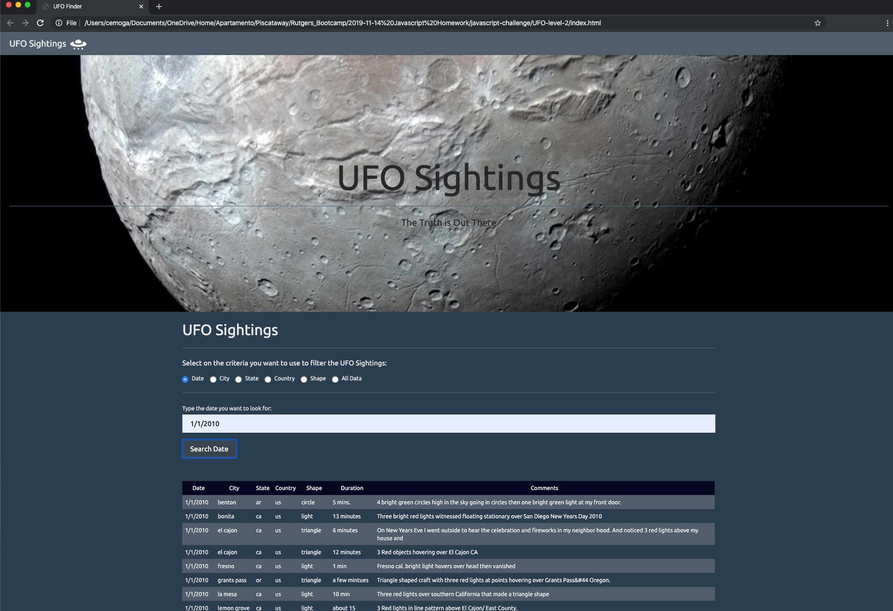

# Javascript - UFO Sighting Visualization

UFO-Level-3

---

## Project Description

The goal of the project was to visualize UFO Sighting Data by using HTML, Javascript, Bootstrap and the D3.js library. Different levels were used to add new and more complex interactive filters to the visualization.

- The `/UFO-Level-1`folder contains the files to only filtered the data by date.  
- The `/UFO-Level-2`folder contains the modified files that filter the data by date and multiple criteria.
- The `/UFO-Level-2`folder contains the modified files that allow filtering by using dropdown menus instead of typing.

---

### Sample website

UFO-Level-1

---

UFO-Level-2

---

## Instructions

1. For the first part of the project, open the `/UFO-Level-1/index.html` and follow the instructions shown there.
2. For the more advanced part of the project, open the `/UFO-Level-2/index.html` and follow the instructions shown there.
3. For the most advanced part of the project, open the `/UFO-Level-3/index.html` and follow the instructions shown there.

---

## File Description

<ul>
    <li>UFO-Level-1</li>
    Contains the files to run the `Level-1`part of the project.+
    <ul>
        <li>Static</li>
        <ul>
            <li>index.html</li>
            <ul>
                <li>It contains the HTML code necessary to interact with the final user.</li>
                <li>The index file references and uses `.css`, `.js` code contained in the
                    `UFO-Level-1/static` fulder.</li>
            </ul>
            <li>css</li>
            <ul>
                <li> It contains all the necessary information to format the `UFO-Level-1/index.html` file.</li>
            </ul>
            <li>Images</li>
            <ul>
                <li>nasa.jpg</li>
                It contains a photo of mars from the www.nasa.gov website and it is used in the `UFO-Level-1/index.html`
                file.
                <li>ufo.svg</li>
                It contains a `.sgv` file with the website logo used in the `UFO-Level-1/index.html` file.
            </ul>
            <li>js</li>
            <ul>
                <li>app.js</li>
                It contains the Javascript code that interacts with the final user and shows the data used in the
                `UFO-Level-1/index.html`file.
                <li>data.js</li>
                It contains the UFO Sightings data filtered and displayed in the `UFO-Level-1/index.html`file.
            </ul>
        </ul>
    </ul>
    <li>UFO-Level-2</li>
    <ul>
        <li>Contains the files to run the `Level-2` part of the project.</li>
        <li>All the files and fulders are the same as the `UFO-Level-1`fulder.</li>
    </ul>
    <li>UFO-Level-3</li>
    <ul>
        <li>Contains the files to run the `Level-3` part of the project.</li>
        <li>All the files and fulders are the same as the `UFO-Level-1`fulder.</li>
    </ul>
    <ul>
    </ul>